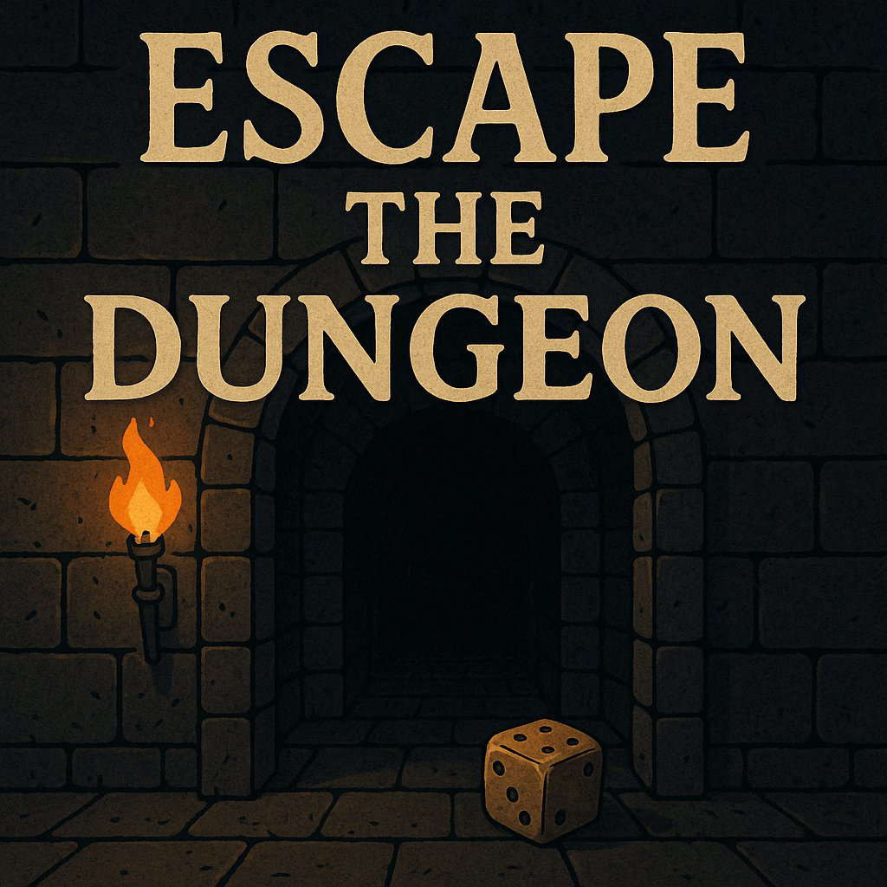

# Escape The Dungeon 🐉

<p align="center">
  
</p>


**Escape The Dungeon** is an interactive Python game I developed as the final project for the [Code in Place 2025](https://codeinplace.stanford.edu/2025/showcase/?project=Hkx72K4JyPeu3CnpoaUYXZQw8Jm2) course by Stanford University. It's a narrative-driven text adventure where each choice influences your fate.

---

## 📁 Repository structure

- `README.md`  
- `LICENSE`  
- `escape_the_dungeon_cover.jpg`
- `original_code_in_place/`  
  - `main.py` (Only runs in Code in Place platform)
- `adapted_version/`  
  - `main.py` (Functional for local environment)
  - `ai.py` (Simulated GPT responses (no API key required))

---


## ▶️ How to play (original version – Code in Place)

> ⚠️ This version only works within the **Code in Place 2025** development platform and cannot be executed outside of that environment.

1. Go to the [Code in Place Project Link](https://codeinplace.stanford.edu/2025/showcase/?project=Hkx72K4JyPeu3CnpoaUYXZQw8Jm2).
2. Click on **"View Project"**.
3. Press the **"Run"** button inside the online editor.
4. Enjoy the story powered by Stanford’s custom GPT interface.

---

## ▶️ How to play (adapted version)

1. Make sure you have Python 3 installed.
2. Navigate to the `adapted_version/` folder.
3. Run the game:

   ```bash
   python main.py
